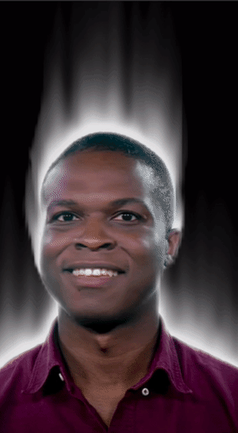

## _How to create a smoke effect with render passes in SparkAR_

This tutorial was made as an entry for the [2020 Developer Circles Community Challenge](https://developercircles2020.devpost.com/) hosted by Facebook.

We'll be showing you how to achieve a smokey shader effect to be applied on any scene item thanks to SparkAR's Render Pass feature as well as a slightly modified patch from the SparkAR library.

_This is what we're building :_

[Click here to view the tutorial](https://the-ar-company.github.io/Smoke_tutorial/) and [download the project files from here](https://github.com/The-AR-Company/Smoke_tutorial/archive/main.zip).