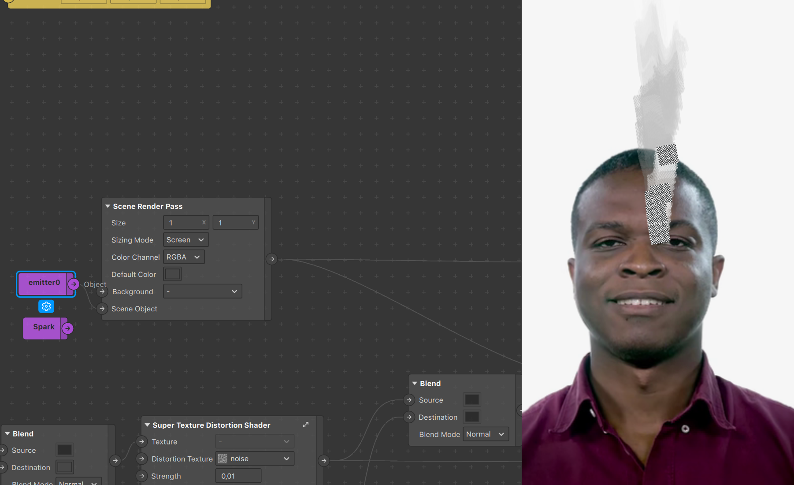

## _How to create a smoke effect with render passes in Spark AR_

### Introduction

This tutorial was made as an entry for the [2020 Developer Circles Community Challenge](https://developercircles2020.devpost.com/) hosted by Facebook.

We'll be showing you how to achieve a smokey shader effect to be applied on any scene object, thanks to Spark AR's [Render Pass](https://sparkar.facebook.com/ar-studio/learn/patch-editor/render-passes/render-passes-overview#limitation) feature as well as a slightly modified patch from the Spark AR library.

_This is what we're building:_

### Before you start

This is everything you will need to get started:
1. A running version of Spark AR v90+ ([Download Spark AR](https://sparkar.facebook.com/ar-studio/download/))
2. Any noise texture (one is provided [here](./downloads/noise.jpg))

That's it!

### Part 1 - _Getting set up_

The idea behind this project is creating a feedback loop effect with the Render Pass feature that we'll use to apply distortion on multiple passes. We'll be using `Delay Frame`s and modifying them on each successive run through said loop. Each iteration will affect the frame, giving it a continuous effect.

The first thing we'll want to do is start from a blank template on Spark AR. From here, we'll set up a few patches and briefly go over why them specifically.
We'll start by bringing in the device output patch, not the default render pass pipeline:

It's important to keep in mind that this is the end of the chain, where you'll plug in the result of all the previous operations in the patch editor. 
To complement this we'll be adding in a `Delay Frame` patch as well as a receiver linked to it. Finally, in this first iteration of the effect we want to apply it to our user, so we'll need to use the person segmentation feature. Select the camera in your Scene tab and navigate to the right:

This will have brought in both cameraTexture0 and personSegmentationMaskTexture0 in your assets panel, drag them in the patch editor and plug them both into a `Pack` patch like shown below:

With this you have all you need to get started, let's move on!

### Part 2 - _Creating the loop_

The basic idea is to modify the `Delay Frame` ouput and send it back to the input. In order to do this, we'll be making use of a `Texture Transform` patch, in tandem with a `2D Transform` patch. These will allow us to modify the delay frames each time they pass through. From here we can't plug this directly into the delay frame, we'll need to go through a `Shader Render Pass` patch first, then output that to our `Delay Frame` patch, as shown below:

What do we feed in the texture slot, you might ask? 
We could just feed the delay frame in it using the receiver patch we set up earlier, however we wanted our effect to apply on the user. In other words, we don't want the effect to apply inside of the person segmentation, rather only on the background. Given that we also want it to draw into the delay frame, we'll make use of a Blend patch set to Normal, and overlay our person segmentation setup with the delay frame, as shown below:

At this point we can connect the output of our blend to the device output and finally see some preliminary results, as it's drawing with the transparency. We can change the background color by touching the color in the delay frame. It's also here that we see our initial loop, that starts from our cameraTexture based setup and goes into the texture transform. From there, it enters the cycle, gets modified, sent to the delay frame; which in turn is fed back into our blend, and sent through the cycle ad infinitum.

Modifying the values within the `2d Transform Pack` will directly impact the effect. For example affecting the scale even by just 0,01 will make the frames scale off in a direction. For our purposes, we want the transformations to be centered, so we'll also set Pivots to 0,5 (they are relative to the screen). You can play around with this to get wild results, from changing the values to using the facetracker position as a driving force, have fun!

This is fundamentally what makes the smoke effect, from here we're going to use a technique called distortion, so every frame gets distorted a little bit more based on the previous distortion.

### Part 3 - _Texture Distortion Shader_

To get started on the distortion, we're going to need two things:
1. [a noise texture](./downloads/noise.jpg)
2. the `Texture Distortion Shader` from the spark AR library

A sample noise texture, and the one we'll be using in this example, can be found in the downloads section on this project's github page. Download it and drag it into your assets panel. Next, go into the Spark AR library and search for the Texture Distortion Shader. Once found, Import it into your project and drag it into your patch editor, using it to connect the delay frame Receiver and the Blend patch, foregoing their initial direct connection.

This patch uses a grayscale texture to distort another texture. It can be useful as-is, but there are a few adjustments that can be made to make it more flexible. We’ll expose one value to control the strength of the distortion (it’s already there, just not exposed), and another to control the direction (by default, the distortion moves diagonally from the top left to bottom right). 

Click the “expand” or master link button to enter the patch group. You’ll see a find the multiply patch toward the beginning of the graph and click on the input. It will show a button that allows you to expose that input as a parameter on the parent group.

This will be the strength parameter. You can name it appropriately, and set some default values and constraints by clicking the cog and selecting “edit properties”

This strength value is affecting the brightness of the distortion texture, so anything less than 1 will be darkening and anything greater than 1 will be brightening. The pixel brightness of the distortion texture is used to determine how far to move the pixels in the main texture. 

_The pictures below use the final version of the effect so it's easier to understand_

The distortion texture gets sampled and swizzled into a vector2, but because this is a grayscale image, the x and y values are both the same, meaning the distortion will always be in a diagonal direction (e.g. one pixel right, one pixel down). We can easily change the direction of the vector by multiplying it by another vector2. 

Now you can expose that value as a parameter called “direction”! Your new `Super Texture Distortion Shader` tm should look like this: 

### Part 4 - _Smoke?_

To set the records straight, this is what you should be seeing in your preview if you've followed accordingly and set the strength parameter to 0,02 as well as the direction to (0,1).

We now have a nice flowy movement that goes upwards. This however is not smoke, as it not only isn't the right color, but it's flowing to infinity and beyond, reaching all the way to the borders of the screen.

We'll tackle the issue of limiting it's reach first. A simple way to do this is to place a Multiply patch in between the delay frame Receiver and our newly-built `Super Texture Distortion Shader` tm. Given that the receiver is transmitting a texture, we can easily affect it's opacity by setting the multiplier to anything below 1.

Now that we've successfully limited the reach of the smoke, let's quickly make the background more visible, partly because smoke will stand out more on a black background, partly because we've done this setup before (and without this little addition things are hard to see).

Add a `Blend` patch between your newly added `Multiply` patch and the `Super Texture Distortion Shader` tm like so:

This also addresses an issue we've kept silent about that you may have noticed: you haven't been able to change the background color for a while... This `Blend` patch will mainly allow us to do just that!

Now that we have the background color set, we need to attack the actual smoke's color, which ideally we want to be white. The trick here is rethinking what we initially feed into the loop. As you can see in the preview, we currently have the segmentation in use, however showing the cameraTexture through. We'd want the same, but filled in with a flat color. You guessed it (or not), that's exactly what the personSegmentationMaskTexture0's Alpha channel is, a white person segmentation mask. So we'll feed that in!

Concretely, bring the `Blend` patch connected to the `Device Output` upwards and add another one underneath. This new patch will take the Alpha output from the personSegmentationMaskTexture patch as a source, and, since we want it in the loop, will take your `Super Texture Distortion Shader` tm as destination input. This way, the alpha channel is thrown into the delay frame, distorted, cycled back, etc.

Finally, we'll quickly just smoothen our results by retouching the person segmentation alpha a tiny bit before we plug it in the rest. A quick swizzle set on 111x will allow us to focus on getting the alpha information without bothering about any RGB changes.

This leads us to the final project setup, featuring a nice smokin' Dolapo. The effect can of course be applied to a variety of things as well as tweaked and tuned to stray very far from our present use case, as we'll demonstrate with a few examples.

### Part 5 - _Applying it to a 3D scene object_

The most common use case we'd imagine people wanting from this setup is applying it to a 3D scene object. Doing so requires importing any 3D object in your scene. For this example we'll just import a primitive shape from the Spark AR library (similarly to how we imported the initial `Texture Distortion` patch) and drag it in the scene.

It's important to understand why we're modifying things the way we are, so we'll attempt to make it as clear as possible.

Remember how we decided from the start this was going to be applied to our user, which in turn led us to use person segmentation? That's not the case anymore, since we want our smoke to be generated based on the scene object. There are two things we want to take into account:
1. What we want to use to drive the distortion.
2. What we want rendered in the front.

The first point is rather straightforward, as we want to be generating the smoke based on the 3d object and not the segmentation. We simply have to feed our 3D object as the base image in our infinite loop. In order to do this, and because of our use of the Render Pass feature, we're going to make use of a `Scene Render Pass` patch. Simply dragging the object in the scene isn't enough for it to be visible, we need to tell Spark AR to render it.

We can see that the smoke is indeed being generated by our 3d object thanks to its visual changes. However our person segmentation is still rendered in the front, hiding a part of the smoke. Furthermore, the 3D object is still not being rendered. What we want is to replace this segmentation with a render of the 3D object, coming from the `Scene Render Pass`.

Now that we do see our 3D object, the smoke has disappeared; a bit of a conundrum. This is simply due to how we've set up our `Scene Render Pass`, whose color is set to black by default. Here unfortunately this leads to complete occlusion of anything that isn't inside the 3D object on the canvas. Thankfully we can directly go and change the Default Color to be transparent, magically making the smoke appear!

And that's how you apply it to a scene object! A final touch here would be to make the background visible, as a black background really isn't very useful. You can do this a plethora of ways but what we'll be doing involves adding a blend patch right after the `Super Texture Distortion Shader` tm in order to blend the results of the loop with the cameraTexture (if you try to feed the cameraTexture within the loop it'll get distorted as well). You can either put a new one or, as shown below, move the one between your `Multiply` and `Super Texture Distortion Shader` tm patch and put it just after in the chain.

_The effect can be applied to an emitter using the exact same technique_

### Conclusion

Now that you have the `Super Texture Distortion Shader` tm and you know how to make smoke with it, here are a few things to experiment with: 

- Animated noise to make the smoke more fluid!
- Animation sequences, like fire!
- Try making a glass effect with the distortion patch!
- Multiply the smoke emitter by an animated color value!
- Smoke + distortion for some heat waves!

