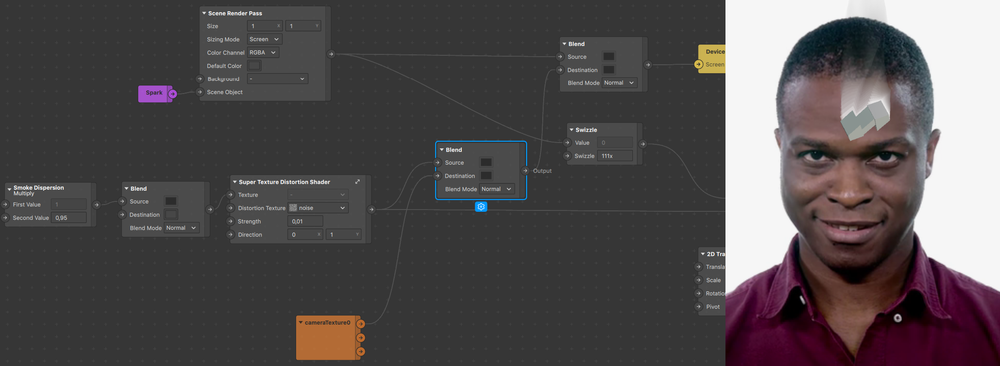

## _How to create a smoke effect with render passes in Spark AR Studio_

This tutorial was made as an entry for the [2020 Developer Circles Community Challenge](https://developercircles2020.devpost.com/) hosted by Facebook.

We'll be showing you how to achieve a smokey shader effect to be applied on any scene object, thanks to Spark AR Studio's [Render Pass](https://sparkar.facebook.com/ar-studio/learn/patch-editor/render-passes/render-passes-overview#limitation) feature as well as a slightly modified patch from the Spark AR Studio AR Library.

### Before you start

This is everything you will need to get started:
1. A running version of Spark AR Studio v90+ ([Download Spark AR Studio](https://sparkar.facebook.com/ar-studio/download/))
2. Any noise texture (one is provided [here](./downloads/noise.jpg))

That's it!

### Part 1 - _Getting set up_

The idea behind this project is creating a feedback loop effect with the Render Pass feature that we'll use to apply distortion on multiple passes. We'll be using `Delay Frame`s and modifying them on each successive run through said loop. Each iteration will affect the frame, giving it a continuous effect.

The first thing we'll want to do is start from a blank template on Spark AR Studio. From here, we'll set up a few patches and briefly go over why them specifically.
We'll then proceed to bring in the device output patch only (not the default render pass pipeline) to begin using the Render Pass feature :

It's important to keep in mind that this is the end of the chain, where you'll plug in the result of all the previous operations in the patch editor. 
To complement this we'll be adding in a `Delay Frame` patch as well as a receiver linked to it. Finally, in this first iteration of the effect we want to apply it to our user, as seen on the GIF above, so we'll need to use the person segmentation feature. Select the camera in your Scene tab and navigate to the right:

This will have brought in both cameraTexture0 and personSegmentationMaskTexture0 in your assets panel, drag them in the patch editor and plug them both into a `Pack` patch vector 2, using the cameraTexture0 RGB channel and the personSegmentationMaskTexture0 Alpha channel, like shown below :

The output of this setup is a texture comprised only of the person in the camera feed, with the background alpha'd out, hence the base we want to make "smokey".

With this you have all you need to get started, let's move on!

### Part 2 - _Creating the loop_

The basic idea is to take the output of the `Delay Frame`, apply some transformations on it, and feed it back in the same `Delay Frame`, creating our loop. For the transformations, we'll be making use of a `Texture Transform` patch, in tandem with a `2D Transform` patch. These will allow us to modify the delay frames each time they pass through. 

Important to note here that we're dealing with shaders. As such we can't just feed our `Delay Frame` the result of our transformations and must go through a `Shader Render Pass` patch, then output that to our `Delay Frame` patch, as shown below:

What do we feed in the texture slot of our `Texture Transform`, you might ask? 
We could just feed the `Delay Frame` in it using the `Receiver` patch we set up earlier, however should we do that, the transformations will be applied on our entire cameraTexture. Whereas we currently want to make our user seem smokey, which means only affecting the background, not the person segmentation. Given that we still want the person segmentation to draw into the `Delay frame` however, we'll make use of a `Blend` patch set to Normal, and overlay our person segmentation setup with the `Delay Frame`, as shown below:

At this point we can connect the output of our `Blend` to the `Device` output and finally see some preliminary results, as it's drawing with the transparency. 

We can change the background color by modifying the one in the `Delay Frame`. 

Also noteworthy is that we see our initial loop fully fleshed out :
- it starts with the cameraTexture and personSegmentation mix entering the `Blend`patch
- this output then gets transformed before being fed into the `Delay Frame`
- it cycles from the `Delay Frame`to the `Receiver`, bringing it back inside the `Blend`to repeat the loop ad infinitum

Modifying the values within the `2d Transform Pack` will directly impact the effect. For example changing the scale even by just 0,01 will make each delayed frame scale increasingly on each loop. For our purposes, we want the transformations to be centered, so we'll also set Pivots to 0,5 (they are relative to the screen). You can play around with this to get wild results, from randomizing the values to using the facetracker position as a driving force, have fun!

This is fundamentally what makes the smoke effect, from here we're going to use a technique called distortion, so every frame gets "distorted" -aka transformed- a little bit more with each pass into the loop, similarly to the scaling effect just above.

### Part 3 - _Texture Distortion Shader_

To get started using distortion, we're going to need two things:
1. [a noise texture](./downloads/noise.jpg)
2. the `Texture Distortion Shader` from the Spark AR Studio AR Library

A sample noise texture, and the one we'll be using in this example, can be found in the downloads section on this project's [github page](https://github.com/The-AR-Company/Smoke_tutorial). Download it and drag it into your assets panel. Next, go into the Spark AR Studio AR Library and search for the `Texture Distortion Shader`. Once found, import it into your project and drag it into your patch editor, using it to connect the delay frame `Receiver` and the `Blend` patch, foregoing their initial direct connection. This will add the distortion step in the loop, being applied from the first cycle onwards.

This patch uses a grayscale texture to distort another texture. The way it goes about this is going through each pixel comprising both images and using the colors, ranging from white to black, of the grayscale image's pixels to determine how much it will displace the pixels of the original image. This becomes quite obvious visually speaking once put into action, as seen in the screenshots below. We can identify that the `Texture Distortion Shader`has deformed our delayed frame following a similar pattern to that of the noise.jpg texture we're feeding it.

It can be useful as-is, but there are a few adjustments that can be made to make it more flexible. We’ll expose one value to control the strength of the distortion (it’s already there, just not exposed), and another to control the direction (by default, the distortion moves diagonally from the top left to bottom right). 

Click the “expand” or master link button to enter the patch group. You’ll see a `Multiply` patch toward the beginning of the graph, click on its input. It will show a button that allows you to expose that input as a parameter on the parent group.

This will be the strength parameter. You can name it appropriately, and set some default values and constraints by clicking the cog and selecting “edit properties”

This strength value as you may have guessed is directly affecting the brightness of the distortion texture, aka the noise.jpg grayscale image, via multiplication. Affecting the brightness of this texture will naturally impact the individual color of each of it's pixels, in turn affecting the displacemenf of each pixel in the original texture. Anything less than 1 will darken the image, leading to smaller displacements, whereas anything higher than 1 will brighten the image, strenghtening of the effect.

_The pictures below use the final version of the effect so it's easier to understand_

The distortion texture gets sampled and swizzled into a vector2, but because this is a grayscale image, the x and y values are both the same, meaning the distortion will always be in a diagonal direction (e.g. one pixel right, one pixel down). We can easily change the direction of the vector by multiplying it by another vector2. In order to do this, add a `Multiply`patch in between the `Swizzle`output and the `Add`patch it's connected to.

Now you can expose that value as a parameter called “direction”! Your new `Super Texture Distortion Shader` tm should look like this: 

### Part 4 - _Smoke?_

To set the records straight, this is what you should be seeing in your preview if you've followed accordingly and set the strength parameter to 0,02 as well as the direction to (0,1).

We now have a nice flowy movement that goes upwards. This however is not smoke, as it not only isn't the right color, but it's flowing to infinity and beyond, reaching all the way to the borders of the screen.

We'll tackle the issue of limiting its reach first. A simple way to do this is to place a `Multiply` patch in between the delay frame `Receiver` and our newly-built `Super Texture Distortion Shader` tm. Given that the receiver is transmitting a texture, we can easily affect it's opacity by setting the multiplier to anything below 1. Our loop setup will ensure that each successive cycle is more and more transparent, eventually fading out completely.

Now that we've successfully limited the reach of the smoke, let's quickly make the background more visible, partly because smoke will stand out more on a black background, partly because we've done this setup before (and without this little addition things are hard to see).

Add a `Blend` patch between your newly added `Multiply` patch and the `Super Texture Distortion Shader` tm like so:

This also addresses an issue we've kept silent about that you may have noticed: you haven't been able to change the background color for a while... This `Blend` patch will mainly allow us to do just that!

Now that we have the background color set, we need to attack the actual smoke's color, which ideally we want to be white. The trick here is rethinking what we initially feed into the loop. As you can see in the preview, we currently have the person segmentation in use, however merely as an alpha to the cameraTexture, which is still showing on every delayed frame. We'd want the same, but filled in with a flat color...

You guessed it (or not), that's exactly what the personSegmentationMaskTexture0's Alpha channel is, a white person segmentation mask. So we'll feed that in instead!

Concretely, bring the `Blend` patch connected to the `Device Output` upwards and add another one underneath. This new patch will take the Alpha output from the personSegmentationMaskTexture patch as a source, and, since we want it in the loop, will take your `Super Texture Distortion Shader` tm as destination input. It's output will be fed into the `Texture Sampler`, this way the alpha channel is thrown into the delay frame, distorted, cycled back, etc.

Finally, we'll quickly just smoothen our results by retouching the person segmentation alpha a tiny bit before we plug it in the rest. A quick swizzle set on 111x will allow us to focus on getting the alpha information without bothering about any RGB changes.

This leads us to the final project setup, featuring a nice smokin' Dolapo. The effect can of course be applied to a variety of things as well as tweaked and tuned to stray very far from our present use case, as we'll demonstrate with a few examples.

### Part 5 - _Applying it to a 3D scene object_

The most common use case we'd imagine people wanting from this setup is applying it to a 3D scene object. Doing so requires importing any 3D object in your scene. For this example we'll just import a primitive shape from the Spark AR Studio AR Library (similarly to how we imported the initial `Texture Distortion` patch) and drag it in the scene.

It's important to understand why we're modifying things the way we are, so we'll attempt to make it as clear as possible.

Remember how we decided from the start this was going to be applied to our user, which in turn led us to use person segmentation? That's not the case anymore, since we want our smoke to be generated based on the scene object. There are two things we want to take into account:
1. What we want to use to drive the distortion.
2. What we want rendered in the front.

The first point is rather straightforward, as we want to be generating the smoke based on the 3d object and not the segmentation. We simply have to feed our 3D object as the base image in our infinite loop. In order to do this, and because of our use of the Render Pass feature, we're going to make use of a `Scene Render Pass` patch. Simply dragging the object in the scene isn't enough for it to be visible, we need to tell Spark AR Studio to render it.

We can see that the smoke is indeed being generated by our 3d object thanks to the visual changes in the preview. However our person segmentation is still rendered in the front, hiding a part of the smoke. Furthermore, the 3D object is still not being rendered. What we want is to replace this segmentation with a render of the 3D object, coming from the `Scene Render Pass`.

Now that we do see our 3D object, the smoke has disappeared; a bit of a conundrum. This is simply due to how we've set up our `Scene Render Pass`, whose color is set to black by default. Here unfortunately this leads to complete occlusion of anything that isn't inside the 3D object on the canvas. Thankfully we can directly go and change the Default Color to be transparent, magically making the smoke appear!

And that's how you apply it to a scene object! A final touch here would be to make the background visible, as a black background really isn't very useful. You can do this a plethora of ways but what we'll be doing involves adding a `Blend` patch right after the `Super Texture Distortion Shader` tm in order to blend the results of the loop with the cameraTexture (if you try to feed the cameraTexture within the loop it'll get distorted as well). You can either put a new one or, as shown below, move the one between your `Multiply` and `Super Texture Distortion Shader` tm patch and put it just after in the chain.

### Conclusion

Now that you have the `Super Texture Distortion Shader` tm and you know how to make smoke with it, here are a few things to experiment with: 

- Animated noise to make the smoke more fluid!
- Animation sequences, like fire!
- Try making a glass effect with the distortion patch!
- Multiply the smoke emitter by an animated color value!
- Smoke + distortion for some heat waves!

### Inspiration

Check out these cool smokey effects! If you make something cool, tag us on IG [@popul_ar.experience](https://instagram.com/popul_ar.experience).

<blockquote class="instagram-media" data-instgrm-captioned data-instgrm-permalink="https://www.instagram.com/p/CH6LCZilBmo/?utm_source=ig_embed&amp;utm_campaign=loading" data-instgrm-version="13" style=" background:#FFF; border:0; border-radius:3px; box-shadow:0 0 1px 0 rgba(0,0,0,0.5),0 1px 10px 0 rgba(0,0,0,0.15); margin: 1px; max-width:540px; min-width:326px; padding:0; width:99.375%; width:-webkit-calc(100% - 2px); width:calc(100% - 2px);">
 <a href="https://www.instagram.com/p/CH6LCZilBmo/?utm_source=ig_embed&amp;utm_campaign=loading" style=" background:#FFFFFF; line-height:0; padding:0 0; text-align:center; text-decoration:none; width:100%;" target="_blank"> 
 

 
 

 

 
<svg width="50px" height="50px" viewBox="0 0 60 60" version="1.1" xmlns="https://www.w3.org/2000/svg" xmlns:xlink="https://www.w3.org/1999/xlink"><g stroke="none" stroke-width="1" fill="none" fill-rule="evenodd"><g transform="translate(-511.000000, -20.000000)" fill="#000000"><g><path d="M556.869,30.41 C554.814,30.41 553.148,32.076 553.148,34.131 C553.148,36.186 554.814,37.852 556.869,37.852 C558.924,37.852 560.59,36.186 560.59,34.131 C560.59,32.076 558.924,30.41 556.869,30.41 M541,60.657 C535.114,60.657 530.342,55.887 530.342,50 C530.342,44.114 535.114,39.342 541,39.342 C546.887,39.342 551.658,44.114 551.658,50 C551.658,55.887 546.887,60.657 541,60.657 M541,33.886 C532.1,33.886 524.886,41.1 524.886,50 C524.886,58.899 532.1,66.113 541,66.113 C549.9,66.113 557.115,58.899 557.115,50 C557.115,41.1 549.9,33.886 541,33.886 M565.378,62.101 C565.244,65.022 564.756,66.606 564.346,67.663 C563.803,69.06 563.154,70.057 562.106,71.106 C561.058,72.155 560.06,72.803 558.662,73.347 C557.607,73.757 556.021,74.244 553.102,74.378 C549.944,74.521 548.997,74.552 541,74.552 C533.003,74.552 532.056,74.521 528.898,74.378 C525.979,74.244 524.393,73.757 523.338,73.347 C521.94,72.803 520.942,72.155 519.894,71.106 C518.846,70.057 518.197,69.06 517.654,67.663 C517.244,66.606 516.755,65.022 516.623,62.101 C516.479,58.943 516.448,57.996 516.448,50 C516.448,42.003 516.479,41.056 516.623,37.899 C516.755,34.978 517.244,33.391 517.654,32.338 C518.197,30.938 518.846,29.942 519.894,28.894 C520.942,27.846 521.94,27.196 523.338,26.654 C524.393,26.244 525.979,25.756 528.898,25.623 C532.057,25.479 533.004,25.448 541,25.448 C548.997,25.448 549.943,25.479 553.102,25.623 C556.021,25.756 557.607,26.244 558.662,26.654 C560.06,27.196 561.058,27.846 562.106,28.894 C563.154,29.942 563.803,30.938 564.346,32.338 C564.756,33.391 565.244,34.978 565.378,37.899 C565.522,41.056 565.552,42.003 565.552,50 C565.552,57.996 565.522,58.943 565.378,62.101 M570.82,37.631 C570.674,34.438 570.167,32.258 569.425,30.349 C568.659,28.377 567.633,26.702 565.965,25.035 C564.297,23.368 562.623,22.342 560.652,21.575 C558.743,20.834 556.562,20.326 553.369,20.18 C550.169,20.033 549.148,20 541,20 C532.853,20 531.831,20.033 528.631,20.18 C525.438,20.326 523.257,20.834 521.349,21.575 C519.376,22.342 517.703,23.368 516.035,25.035 C514.368,26.702 513.342,28.377 512.574,30.349 C511.834,32.258 511.326,34.438 511.181,37.631 C511.035,40.831 511,41.851 511,50 C511,58.147 511.035,59.17 511.181,62.369 C511.326,65.562 511.834,67.743 512.574,69.651 C513.342,71.625 514.368,73.296 516.035,74.965 C517.703,76.634 519.376,77.658 521.349,78.425 C523.257,79.167 525.438,79.673 528.631,79.82 C531.831,79.965 532.853,80.001 541,80.001 C549.148,80.001 550.169,79.965 553.369,79.82 C556.562,79.673 558.743,79.167 560.652,78.425 C562.623,77.658 564.297,76.634 565.965,74.965 C567.633,73.296 568.659,71.625 569.425,69.651 C570.167,67.743 570.674,65.562 570.82,62.369 C570.966,59.17 571,58.147 571,50 C571,41.851 570.966,40.831 570.82,37.631"></path></g></g></g></svg>

 
 View this post on Instagram

 

 

 

 

 

 

 

 

 

 
 

 

</a>
<a href="https://www.instagram.com/p/CH6LCZilBmo/?utm_source=ig_embed&amp;utm_campaign=loading" style=" color:#c9c8cd; font-family:Arial,sans-serif; font-size:14px; font-style:normal; font-weight:normal; line-height:17px; text-decoration:none;" target="_blank">A post shared by ᖴIᑎO (@finofinissimo)</a>

</blockquote> 

<blockquote class="instagram-media" data-instgrm-captioned data-instgrm-permalink="https://www.instagram.com/p/CH7NEKNJb6j/?utm_source=ig_embed&amp;utm_campaign=loading" data-instgrm-version="13" style=" background:#FFF; border:0; border-radius:3px; box-shadow:0 0 1px 0 rgba(0,0,0,0.5),0 1px 10px 0 rgba(0,0,0,0.15); margin: 1px; max-width:540px; min-width:326px; padding:0; width:99.375%; width:-webkit-calc(100% - 2px); width:calc(100% - 2px);">
 <a href="https://www.instagram.com/p/CH7NEKNJb6j/?utm_source=ig_embed&amp;utm_campaign=loading" style=" background:#FFFFFF; line-height:0; padding:0 0; text-align:center; text-decoration:none; width:100%;" target="_blank"> 
 

 
 

 

 
<svg width="50px" height="50px" viewBox="0 0 60 60" version="1.1" xmlns="https://www.w3.org/2000/svg" xmlns:xlink="https://www.w3.org/1999/xlink"><g stroke="none" stroke-width="1" fill="none" fill-rule="evenodd"><g transform="translate(-511.000000, -20.000000)" fill="#000000"><g><path d="M556.869,30.41 C554.814,30.41 553.148,32.076 553.148,34.131 C553.148,36.186 554.814,37.852 556.869,37.852 C558.924,37.852 560.59,36.186 560.59,34.131 C560.59,32.076 558.924,30.41 556.869,30.41 M541,60.657 C535.114,60.657 530.342,55.887 530.342,50 C530.342,44.114 535.114,39.342 541,39.342 C546.887,39.342 551.658,44.114 551.658,50 C551.658,55.887 546.887,60.657 541,60.657 M541,33.886 C532.1,33.886 524.886,41.1 524.886,50 C524.886,58.899 532.1,66.113 541,66.113 C549.9,66.113 557.115,58.899 557.115,50 C557.115,41.1 549.9,33.886 541,33.886 M565.378,62.101 C565.244,65.022 564.756,66.606 564.346,67.663 C563.803,69.06 563.154,70.057 562.106,71.106 C561.058,72.155 560.06,72.803 558.662,73.347 C557.607,73.757 556.021,74.244 553.102,74.378 C549.944,74.521 548.997,74.552 541,74.552 C533.003,74.552 532.056,74.521 528.898,74.378 C525.979,74.244 524.393,73.757 523.338,73.347 C521.94,72.803 520.942,72.155 519.894,71.106 C518.846,70.057 518.197,69.06 517.654,67.663 C517.244,66.606 516.755,65.022 516.623,62.101 C516.479,58.943 516.448,57.996 516.448,50 C516.448,42.003 516.479,41.056 516.623,37.899 C516.755,34.978 517.244,33.391 517.654,32.338 C518.197,30.938 518.846,29.942 519.894,28.894 C520.942,27.846 521.94,27.196 523.338,26.654 C524.393,26.244 525.979,25.756 528.898,25.623 C532.057,25.479 533.004,25.448 541,25.448 C548.997,25.448 549.943,25.479 553.102,25.623 C556.021,25.756 557.607,26.244 558.662,26.654 C560.06,27.196 561.058,27.846 562.106,28.894 C563.154,29.942 563.803,30.938 564.346,32.338 C564.756,33.391 565.244,34.978 565.378,37.899 C565.522,41.056 565.552,42.003 565.552,50 C565.552,57.996 565.522,58.943 565.378,62.101 M570.82,37.631 C570.674,34.438 570.167,32.258 569.425,30.349 C568.659,28.377 567.633,26.702 565.965,25.035 C564.297,23.368 562.623,22.342 560.652,21.575 C558.743,20.834 556.562,20.326 553.369,20.18 C550.169,20.033 549.148,20 541,20 C532.853,20 531.831,20.033 528.631,20.18 C525.438,20.326 523.257,20.834 521.349,21.575 C519.376,22.342 517.703,23.368 516.035,25.035 C514.368,26.702 513.342,28.377 512.574,30.349 C511.834,32.258 511.326,34.438 511.181,37.631 C511.035,40.831 511,41.851 511,50 C511,58.147 511.035,59.17 511.181,62.369 C511.326,65.562 511.834,67.743 512.574,69.651 C513.342,71.625 514.368,73.296 516.035,74.965 C517.703,76.634 519.376,77.658 521.349,78.425 C523.257,79.167 525.438,79.673 528.631,79.82 C531.831,79.965 532.853,80.001 541,80.001 C549.148,80.001 550.169,79.965 553.369,79.82 C556.562,79.673 558.743,79.167 560.652,78.425 C562.623,77.658 564.297,76.634 565.965,74.965 C567.633,73.296 568.659,71.625 569.425,69.651 C570.167,67.743 570.674,65.562 570.82,62.369 C570.966,59.17 571,58.147 571,50 C571,41.851 570.966,40.831 570.82,37.631"></path></g></g></g></svg>

 
 View this post on Instagram

 

 

 

 

 

 

 

 

 

 
 

 

</a>
<a href="https://www.instagram.com/p/CH7NEKNJb6j/?utm_source=ig_embed&amp;utm_campaign=loading" style=" color:#c9c8cd; font-family:Arial,sans-serif; font-size:14px; font-style:normal; font-weight:normal; line-height:17px; text-decoration:none;" target="_blank">A post shared by Craig Lewis (@iamcraiglewis2)</a>

</blockquote> 

<blockquote class="instagram-media" data-instgrm-captioned data-instgrm-permalink="https://www.instagram.com/p/CH5hc4QFPd2/?utm_source=ig_embed&amp;utm_campaign=loading" data-instgrm-version="13" style=" background:#FFF; border:0; border-radius:3px; box-shadow:0 0 1px 0 rgba(0,0,0,0.5),0 1px 10px 0 rgba(0,0,0,0.15); margin: 1px; max-width:540px; min-width:326px; padding:0; width:99.375%; width:-webkit-calc(100% - 2px); width:calc(100% - 2px);">
 <a href="https://www.instagram.com/p/CH5hc4QFPd2/?utm_source=ig_embed&amp;utm_campaign=loading" style=" background:#FFFFFF; line-height:0; padding:0 0; text-align:center; text-decoration:none; width:100%;" target="_blank"> 
 

 
 

 

 
<svg width="50px" height="50px" viewBox="0 0 60 60" version="1.1" xmlns="https://www.w3.org/2000/svg" xmlns:xlink="https://www.w3.org/1999/xlink"><g stroke="none" stroke-width="1" fill="none" fill-rule="evenodd"><g transform="translate(-511.000000, -20.000000)" fill="#000000"><g><path d="M556.869,30.41 C554.814,30.41 553.148,32.076 553.148,34.131 C553.148,36.186 554.814,37.852 556.869,37.852 C558.924,37.852 560.59,36.186 560.59,34.131 C560.59,32.076 558.924,30.41 556.869,30.41 M541,60.657 C535.114,60.657 530.342,55.887 530.342,50 C530.342,44.114 535.114,39.342 541,39.342 C546.887,39.342 551.658,44.114 551.658,50 C551.658,55.887 546.887,60.657 541,60.657 M541,33.886 C532.1,33.886 524.886,41.1 524.886,50 C524.886,58.899 532.1,66.113 541,66.113 C549.9,66.113 557.115,58.899 557.115,50 C557.115,41.1 549.9,33.886 541,33.886 M565.378,62.101 C565.244,65.022 564.756,66.606 564.346,67.663 C563.803,69.06 563.154,70.057 562.106,71.106 C561.058,72.155 560.06,72.803 558.662,73.347 C557.607,73.757 556.021,74.244 553.102,74.378 C549.944,74.521 548.997,74.552 541,74.552 C533.003,74.552 532.056,74.521 528.898,74.378 C525.979,74.244 524.393,73.757 523.338,73.347 C521.94,72.803 520.942,72.155 519.894,71.106 C518.846,70.057 518.197,69.06 517.654,67.663 C517.244,66.606 516.755,65.022 516.623,62.101 C516.479,58.943 516.448,57.996 516.448,50 C516.448,42.003 516.479,41.056 516.623,37.899 C516.755,34.978 517.244,33.391 517.654,32.338 C518.197,30.938 518.846,29.942 519.894,28.894 C520.942,27.846 521.94,27.196 523.338,26.654 C524.393,26.244 525.979,25.756 528.898,25.623 C532.057,25.479 533.004,25.448 541,25.448 C548.997,25.448 549.943,25.479 553.102,25.623 C556.021,25.756 557.607,26.244 558.662,26.654 C560.06,27.196 561.058,27.846 562.106,28.894 C563.154,29.942 563.803,30.938 564.346,32.338 C564.756,33.391 565.244,34.978 565.378,37.899 C565.522,41.056 565.552,42.003 565.552,50 C565.552,57.996 565.522,58.943 565.378,62.101 M570.82,37.631 C570.674,34.438 570.167,32.258 569.425,30.349 C568.659,28.377 567.633,26.702 565.965,25.035 C564.297,23.368 562.623,22.342 560.652,21.575 C558.743,20.834 556.562,20.326 553.369,20.18 C550.169,20.033 549.148,20 541,20 C532.853,20 531.831,20.033 528.631,20.18 C525.438,20.326 523.257,20.834 521.349,21.575 C519.376,22.342 517.703,23.368 516.035,25.035 C514.368,26.702 513.342,28.377 512.574,30.349 C511.834,32.258 511.326,34.438 511.181,37.631 C511.035,40.831 511,41.851 511,50 C511,58.147 511.035,59.17 511.181,62.369 C511.326,65.562 511.834,67.743 512.574,69.651 C513.342,71.625 514.368,73.296 516.035,74.965 C517.703,76.634 519.376,77.658 521.349,78.425 C523.257,79.167 525.438,79.673 528.631,79.82 C531.831,79.965 532.853,80.001 541,80.001 C549.148,80.001 550.169,79.965 553.369,79.82 C556.562,79.673 558.743,79.167 560.652,78.425 C562.623,77.658 564.297,76.634 565.965,74.965 C567.633,73.296 568.659,71.625 569.425,69.651 C570.167,67.743 570.674,65.562 570.82,62.369 C570.966,59.17 571,58.147 571,50 C571,41.851 570.966,40.831 570.82,37.631"></path></g></g></g></svg>

 
 View this post on Instagram

 

 

 

 

 

 

 

 

 

 
 

 

</a>
<a href="https://www.instagram.com/p/CH5hc4QFPd2/?utm_source=ig_embed&amp;utm_campaign=loading" style=" color:#c9c8cd; font-family:Arial,sans-serif; font-size:14px; font-style:normal; font-weight:normal; line-height:17px; text-decoration:none;" target="_blank">A post shared by Sarah M. (@sarahmayer.co)</a>

</blockquote> 

<blockquote class="instagram-media" data-instgrm-captioned data-instgrm-permalink="https://www.instagram.com/p/CDE8lJuApV9/?utm_source=ig_embed&amp;utm_campaign=loading" data-instgrm-version="13" style=" background:#FFF; border:0; border-radius:3px; box-shadow:0 0 1px 0 rgba(0,0,0,0.5),0 1px 10px 0 rgba(0,0,0,0.15); margin: 1px; max-width:540px; min-width:326px; padding:0; width:99.375%; width:-webkit-calc(100% - 2px); width:calc(100% - 2px);">
 <a href="https://www.instagram.com/p/CDE8lJuApV9/?utm_source=ig_embed&amp;utm_campaign=loading" style=" background:#FFFFFF; line-height:0; padding:0 0; text-align:center; text-decoration:none; width:100%;" target="_blank"> 
 

 
 

 

 
<svg width="50px" height="50px" viewBox="0 0 60 60" version="1.1" xmlns="https://www.w3.org/2000/svg" xmlns:xlink="https://www.w3.org/1999/xlink"><g stroke="none" stroke-width="1" fill="none" fill-rule="evenodd"><g transform="translate(-511.000000, -20.000000)" fill="#000000"><g><path d="M556.869,30.41 C554.814,30.41 553.148,32.076 553.148,34.131 C553.148,36.186 554.814,37.852 556.869,37.852 C558.924,37.852 560.59,36.186 560.59,34.131 C560.59,32.076 558.924,30.41 556.869,30.41 M541,60.657 C535.114,60.657 530.342,55.887 530.342,50 C530.342,44.114 535.114,39.342 541,39.342 C546.887,39.342 551.658,44.114 551.658,50 C551.658,55.887 546.887,60.657 541,60.657 M541,33.886 C532.1,33.886 524.886,41.1 524.886,50 C524.886,58.899 532.1,66.113 541,66.113 C549.9,66.113 557.115,58.899 557.115,50 C557.115,41.1 549.9,33.886 541,33.886 M565.378,62.101 C565.244,65.022 564.756,66.606 564.346,67.663 C563.803,69.06 563.154,70.057 562.106,71.106 C561.058,72.155 560.06,72.803 558.662,73.347 C557.607,73.757 556.021,74.244 553.102,74.378 C549.944,74.521 548.997,74.552 541,74.552 C533.003,74.552 532.056,74.521 528.898,74.378 C525.979,74.244 524.393,73.757 523.338,73.347 C521.94,72.803 520.942,72.155 519.894,71.106 C518.846,70.057 518.197,69.06 517.654,67.663 C517.244,66.606 516.755,65.022 516.623,62.101 C516.479,58.943 516.448,57.996 516.448,50 C516.448,42.003 516.479,41.056 516.623,37.899 C516.755,34.978 517.244,33.391 517.654,32.338 C518.197,30.938 518.846,29.942 519.894,28.894 C520.942,27.846 521.94,27.196 523.338,26.654 C524.393,26.244 525.979,25.756 528.898,25.623 C532.057,25.479 533.004,25.448 541,25.448 C548.997,25.448 549.943,25.479 553.102,25.623 C556.021,25.756 557.607,26.244 558.662,26.654 C560.06,27.196 561.058,27.846 562.106,28.894 C563.154,29.942 563.803,30.938 564.346,32.338 C564.756,33.391 565.244,34.978 565.378,37.899 C565.522,41.056 565.552,42.003 565.552,50 C565.552,57.996 565.522,58.943 565.378,62.101 M570.82,37.631 C570.674,34.438 570.167,32.258 569.425,30.349 C568.659,28.377 567.633,26.702 565.965,25.035 C564.297,23.368 562.623,22.342 560.652,21.575 C558.743,20.834 556.562,20.326 553.369,20.18 C550.169,20.033 549.148,20 541,20 C532.853,20 531.831,20.033 528.631,20.18 C525.438,20.326 523.257,20.834 521.349,21.575 C519.376,22.342 517.703,23.368 516.035,25.035 C514.368,26.702 513.342,28.377 512.574,30.349 C511.834,32.258 511.326,34.438 511.181,37.631 C511.035,40.831 511,41.851 511,50 C511,58.147 511.035,59.17 511.181,62.369 C511.326,65.562 511.834,67.743 512.574,69.651 C513.342,71.625 514.368,73.296 516.035,74.965 C517.703,76.634 519.376,77.658 521.349,78.425 C523.257,79.167 525.438,79.673 528.631,79.82 C531.831,79.965 532.853,80.001 541,80.001 C549.148,80.001 550.169,79.965 553.369,79.82 C556.562,79.673 558.743,79.167 560.652,78.425 C562.623,77.658 564.297,76.634 565.965,74.965 C567.633,73.296 568.659,71.625 569.425,69.651 C570.167,67.743 570.674,65.562 570.82,62.369 C570.966,59.17 571,58.147 571,50 C571,41.851 570.966,40.831 570.82,37.631"></path></g></g></g></svg>

 
 View this post on Instagram

 

 

 

 

 

 

 

 

 

 
 

 

</a>
<a href="https://www.instagram.com/p/CDE8lJuApV9/?utm_source=ig_embed&amp;utm_campaign=loading" style=" color:#c9c8cd; font-family:Arial,sans-serif; font-size:14px; font-style:normal; font-weight:normal; line-height:17px; text-decoration:none;" target="_blank">A post shared by Josh Beckwith (@positlabs)</a>

</blockquote> 

<blockquote class="instagram-media" data-instgrm-captioned data-instgrm-permalink="https://www.instagram.com/p/CEgmLxanWeH/?utm_source=ig_embed&amp;utm_campaign=loading" data-instgrm-version="13" style=" background:#FFF; border:0; border-radius:3px; box-shadow:0 0 1px 0 rgba(0,0,0,0.5),0 1px 10px 0 rgba(0,0,0,0.15); margin: 1px; max-width:540px; min-width:326px; padding:0; width:99.375%; width:-webkit-calc(100% - 2px); width:calc(100% - 2px);">
 <a href="https://www.instagram.com/p/CEgmLxanWeH/?utm_source=ig_embed&amp;utm_campaign=loading" style=" background:#FFFFFF; line-height:0; padding:0 0; text-align:center; text-decoration:none; width:100%;" target="_blank"> 
 

 
 

 

 
<svg width="50px" height="50px" viewBox="0 0 60 60" version="1.1" xmlns="https://www.w3.org/2000/svg" xmlns:xlink="https://www.w3.org/1999/xlink"><g stroke="none" stroke-width="1" fill="none" fill-rule="evenodd"><g transform="translate(-511.000000, -20.000000)" fill="#000000"><g><path d="M556.869,30.41 C554.814,30.41 553.148,32.076 553.148,34.131 C553.148,36.186 554.814,37.852 556.869,37.852 C558.924,37.852 560.59,36.186 560.59,34.131 C560.59,32.076 558.924,30.41 556.869,30.41 M541,60.657 C535.114,60.657 530.342,55.887 530.342,50 C530.342,44.114 535.114,39.342 541,39.342 C546.887,39.342 551.658,44.114 551.658,50 C551.658,55.887 546.887,60.657 541,60.657 M541,33.886 C532.1,33.886 524.886,41.1 524.886,50 C524.886,58.899 532.1,66.113 541,66.113 C549.9,66.113 557.115,58.899 557.115,50 C557.115,41.1 549.9,33.886 541,33.886 M565.378,62.101 C565.244,65.022 564.756,66.606 564.346,67.663 C563.803,69.06 563.154,70.057 562.106,71.106 C561.058,72.155 560.06,72.803 558.662,73.347 C557.607,73.757 556.021,74.244 553.102,74.378 C549.944,74.521 548.997,74.552 541,74.552 C533.003,74.552 532.056,74.521 528.898,74.378 C525.979,74.244 524.393,73.757 523.338,73.347 C521.94,72.803 520.942,72.155 519.894,71.106 C518.846,70.057 518.197,69.06 517.654,67.663 C517.244,66.606 516.755,65.022 516.623,62.101 C516.479,58.943 516.448,57.996 516.448,50 C516.448,42.003 516.479,41.056 516.623,37.899 C516.755,34.978 517.244,33.391 517.654,32.338 C518.197,30.938 518.846,29.942 519.894,28.894 C520.942,27.846 521.94,27.196 523.338,26.654 C524.393,26.244 525.979,25.756 528.898,25.623 C532.057,25.479 533.004,25.448 541,25.448 C548.997,25.448 549.943,25.479 553.102,25.623 C556.021,25.756 557.607,26.244 558.662,26.654 C560.06,27.196 561.058,27.846 562.106,28.894 C563.154,29.942 563.803,30.938 564.346,32.338 C564.756,33.391 565.244,34.978 565.378,37.899 C565.522,41.056 565.552,42.003 565.552,50 C565.552,57.996 565.522,58.943 565.378,62.101 M570.82,37.631 C570.674,34.438 570.167,32.258 569.425,30.349 C568.659,28.377 567.633,26.702 565.965,25.035 C564.297,23.368 562.623,22.342 560.652,21.575 C558.743,20.834 556.562,20.326 553.369,20.18 C550.169,20.033 549.148,20 541,20 C532.853,20 531.831,20.033 528.631,20.18 C525.438,20.326 523.257,20.834 521.349,21.575 C519.376,22.342 517.703,23.368 516.035,25.035 C514.368,26.702 513.342,28.377 512.574,30.349 C511.834,32.258 511.326,34.438 511.181,37.631 C511.035,40.831 511,41.851 511,50 C511,58.147 511.035,59.17 511.181,62.369 C511.326,65.562 511.834,67.743 512.574,69.651 C513.342,71.625 514.368,73.296 516.035,74.965 C517.703,76.634 519.376,77.658 521.349,78.425 C523.257,79.167 525.438,79.673 528.631,79.82 C531.831,79.965 532.853,80.001 541,80.001 C549.148,80.001 550.169,79.965 553.369,79.82 C556.562,79.673 558.743,79.167 560.652,78.425 C562.623,77.658 564.297,76.634 565.965,74.965 C567.633,73.296 568.659,71.625 569.425,69.651 C570.167,67.743 570.674,65.562 570.82,62.369 C570.966,59.17 571,58.147 571,50 C571,41.851 570.966,40.831 570.82,37.631"></path></g></g></g></svg>

 
 View this post on Instagram

 

 

 

 

 

 

 

 

 

 
 

 

</a>
<a href="https://www.instagram.com/p/CEgmLxanWeH/?utm_source=ig_embed&amp;utm_campaign=loading" style=" color:#c9c8cd; font-family:Arial,sans-serif; font-size:14px; font-style:normal; font-weight:normal; line-height:17px; text-decoration:none;" target="_blank">A post shared by Ωmega (@omega.c)</a>

</blockquote> 

